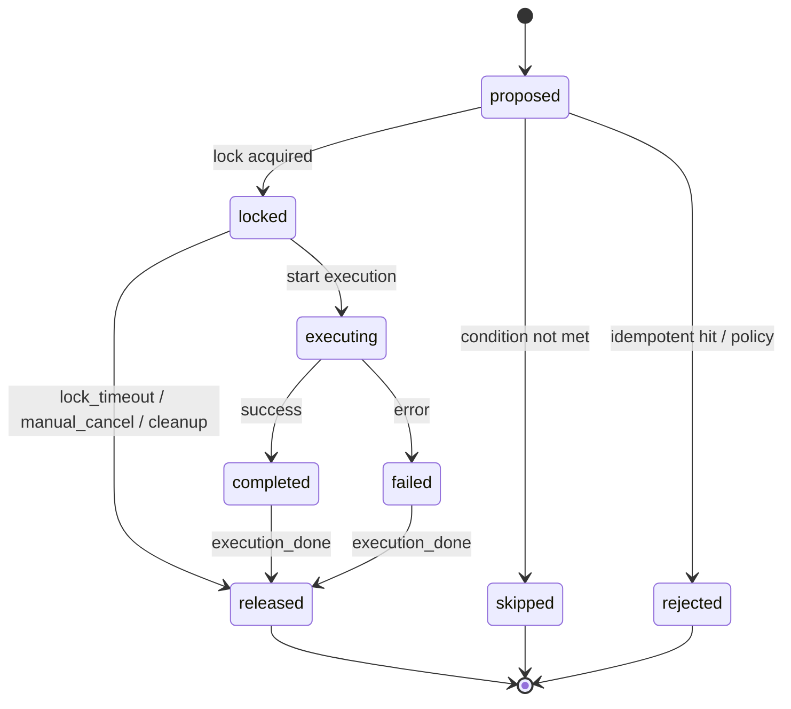

# LEDGER_STATE_MACHINE.md - 状态机与语义规范 v0.2

**版本：** v0.2
**更新：** 2026-03-07 12:10
**变更：** outcome 移除 released；状态机压实；released 必须带 release_reason

---

## 双字段模型

- **status**: 生命周期阶段（action 当前在哪）
- **outcome**: 执行结果（action 最终结果是什么）

## Status（8 个）

| Status | 含义 | 是否终态 |
|--------|------|----------|
| `proposed` | 已提议，等待锁定 | 否 |
| `locked` | 已锁定，等待执行 | 否 |
| `executing` | 正在执行 | 否 |
| `completed` | 执行成功 | 否（等待 released） |
| `failed` | 执行失败 | 否（等待 released） |
| `released` | 资源已释放，生命周期结束 | **是** |
| `skipped` | 被跳过 | **是** |
| `rejected` | 被拒绝 | **是** |

## Outcome（5 个）

| Outcome | 含义 |
|---------|------|
| `unknown` | 未完成（proposed/locked/executing） |
| `completed` | 成功完成 |
| `failed` | 执行失败 |
| `skipped` | 被跳过 |
| `rejected` | 被拒绝 |

**注意：`released` 不是 outcome。** released 是生命周期终态，不是执行结果。

---

## 合法状态迁移

### 主链（推荐）

```
proposed → locked → executing → completed → released (outcome=completed)
proposed → locked → executing → failed    → released (outcome=failed)
proposed → skipped  (outcome=skipped)
proposed → rejected (outcome=rejected)
```

### 谨慎保留

```
locked → released  (outcome=unknown, 仅限锁超时回收，必须带 release_reason)
```

### 禁止

```
executing → released  ← 不允许！必须先 → failed → released
```

---

## Released 语义

released 的 outcome 由前置状态继承：

| 迁移路径 | outcome | release_reason |
|----------|---------|----------------|
| completed → released | completed | execution_done |
| failed → released | failed | execution_done |
| locked → released | unknown | lock_timeout / manual_cancel / cleanup |

### release_reason 枚举

| Reason | 含义 | 允许的前置状态 |
|--------|------|----------------|
| `execution_done` | 正常执行完毕 | completed, failed |
| `lock_timeout` | 锁超时回收 | locked |
| `manual_cancel` | 人工取消 | locked |
| `cleanup` | 系统清理 | locked |

---

## Mermaid 状态图



---

## 指标计算规则

### 成功率（按 outcome 算，不按 released 算）

```
execution_success_rate = outcome=completed / (outcome=completed + outcome=failed)
proposal_acceptance_rate = (locked+executing+completed+failed+released) / proposed
```

### 时延

```
action_duration_ms     = finished_at - created_at  (proposed → completed/failed)
lock_hold_duration_ms  = released_at - locked_at   (locked → released)
queue_wait_duration_ms = locked_at - created_at    (proposed → locked)
```

---

**代码约束：** `action_schema.py`
**实现：** `reality_ledger.py`
