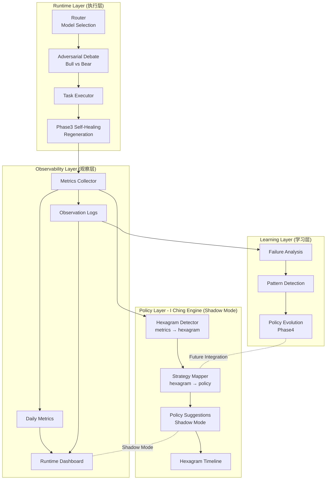
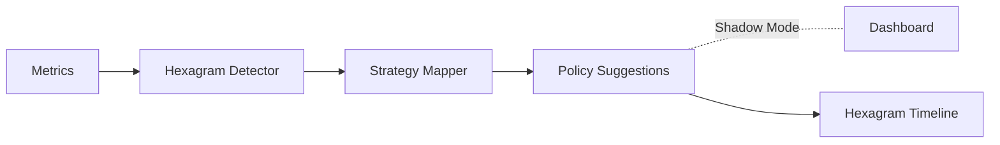

# AIOS × 易经系统架构

## 系统架构图



## 四层架构说明

### 1. Runtime Layer (执行层)
**职责：** 实际执行任务，做出决策

**核心组件：**
- **Router** - 模型选择（Fast/Slow）
- **Adversarial Debate** - Bull vs Bear 辩论验证
- **Task Executor** - 任务执行器
- **Phase3 Self-Healing** - 失败自动重生

**数据流：**
```
Task → Router → Debate → Executor → Healing → Metrics
```

---

### 2. Observability Layer (观察层)
**职责：** 收集指标，记录日志，可视化展示

**核心组件：**
- **Metrics Collector** - 实时指标收集
- **Daily Metrics** - 每日统计
- **Observation Logs** - 观察日志
- **Runtime Dashboard** - 实时仪表盘

**关键指标：**
- `success_rate` - 任务成功率
- `debate_rate` - 辩论触发率
- `avg_latency` - 平均延迟
- `healing_rate` - 自愈成功率

---

### 3. Policy Layer - I Ching Engine (策略层)
**职责：** 解释系统状态，生成策略建议（Shadow Mode）

**核心组件：**
- **Hexagram Detector** - 从指标推导卦象
- **Strategy Mapper** - 从卦象映射策略
- **Policy Suggestions** - 策略建议（Shadow Mode）
- **Hexagram Timeline** - 卦象演化轨迹

**工作流：**
```
Metrics → Hexagram → Strategy → Suggestion (Shadow)
```

**Shadow Mode 特性：**
- ✅ 只建议，不控制
- ✅ 不污染观察期数据
- ✅ 记录卦象演化轨迹
- ✅ Dashboard 可视化展示

**卦象演化示例：**
```
Day1: 坤卦 (稳定期)
Day2: 坤卦 (持续稳定)
Day3: 比卦 (协作增强)
Day4: 大过卦 (负载过高)
Day5: 坎卦 (风险期)
Day6: 复卦 (恢复期)
```

---

### 4. Learning Layer (学习层)
**职责：** 从失败中学习，自动优化策略（Phase4）

**核心组件：**
- **Failure Analysis** - 失败分析
- **Pattern Detection** - 模式识别
- **Policy Evolution** - 策略进化

**未来集成：**
```
Learning Layer → Policy Layer
系统自动优化策略
```

---

## 数据流全景

### 正向流（执行）
```
Task → Router → Debate → Executor → Healing → Metrics
```

### 观察流（监控）
```
Metrics → Daily/Logs → Dashboard
```

### 策略流（Shadow Mode）
```
Metrics → Hexagram → Strategy → Suggestion → Dashboard
```

### 学习流（未来）
```
Logs → Failure → Pattern → Policy Evolution → Strategy Mapper
```

---

## Shadow Mode 设计

### 为什么需要 Shadow Mode？

**问题：** 如果易经直接控制 Runtime，会污染观察期数据

**解决：** Shadow Mode - 只建议，不控制

### Shadow Mode 工作流



### Dashboard 展示示例

```
AIOS Runtime State
────────────────────────────────────
Current Hexagram: 坤卦
System Phase: Stable

Metrics:
  success_rate: 95%
  debate_rate: 12%
  latency: 8.1s

Suggested Strategy (Shadow):
  router_threshold: 0.85
  debate_rate: 0.10
  retry_limit: 2

Hexagram Timeline:
  坤 → 坤 → 比 → 大过
```

---

## 核心设计原则

### 1. 易经是 Policy Layer，不是 Runtime Layer
- ✅ 解释系统状态
- ✅ 生成策略建议
- ❌ 不直接控制执行

### 2. Shadow Mode 保持数据纯净
- ✅ 观察期只建议，不干预
- ✅ 记录卦象演化轨迹
- ✅ Dashboard 可视化展示

### 3. 四层架构完整闭环
- Runtime → Observability → Policy → Learning
- 每层职责清晰，边界明确

### 4. 卦象演化轨迹
- 记录系统生命周期
- 可视化系统状态变化
- 未来用于模式识别

---

## 下一步计划

### Phase 1: Shadow Mode 实现（本周）
1. ✅ 定义 Policy Engine 接口
2. ✅ 实现 `policy/iching_engine.py`
3. ✅ 集成到 Dashboard

### Phase 2: 卦象演化轨迹（下周）
1. 记录每日卦象
2. 生成演化图表
3. 分析状态转换模式

### Phase 3: 策略验证（观察期）
1. 对比 Shadow 建议 vs 实际决策
2. 统计建议准确率
3. 评估策略有效性

### Phase 4: 自动策略优化（未来）
1. Learning Layer → Policy Layer 集成
2. 系统自动优化策略
3. 形成完整闭环

---

## 技术栈

- **Runtime Layer:** Python 3.12 + sessions_spawn
- **Observability Layer:** JSON logs + Mermaid charts
- **Policy Layer:** I Ching Engine (Shadow Mode)
- **Learning Layer:** LanceDB + Pattern Detection

---

**版本：** v1.0  
**最后更新：** 2026-03-05  
**维护者：** 小九 + 珊瑚海
