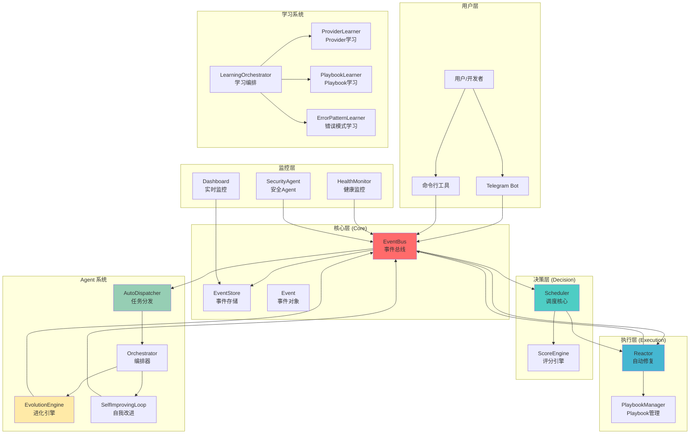
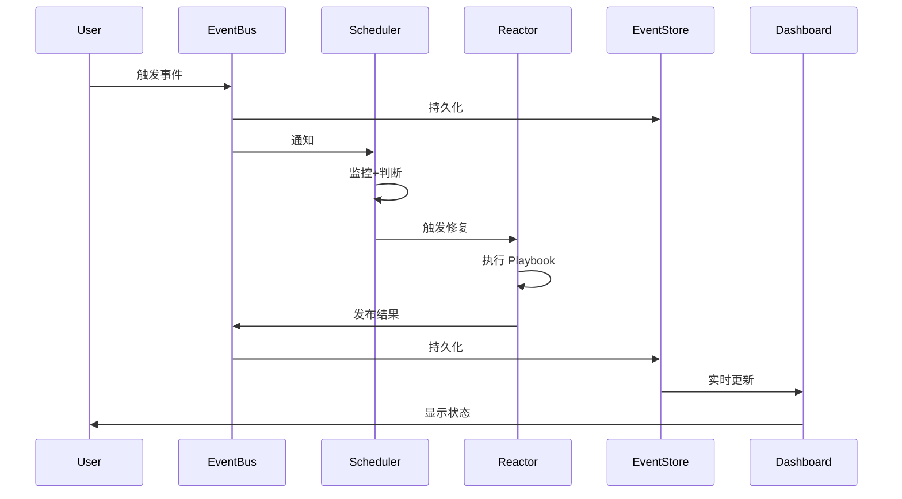
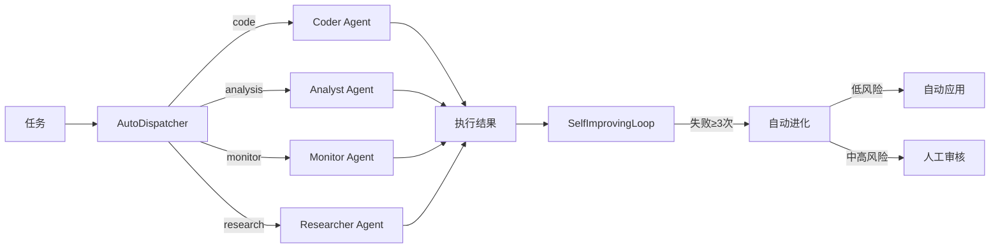
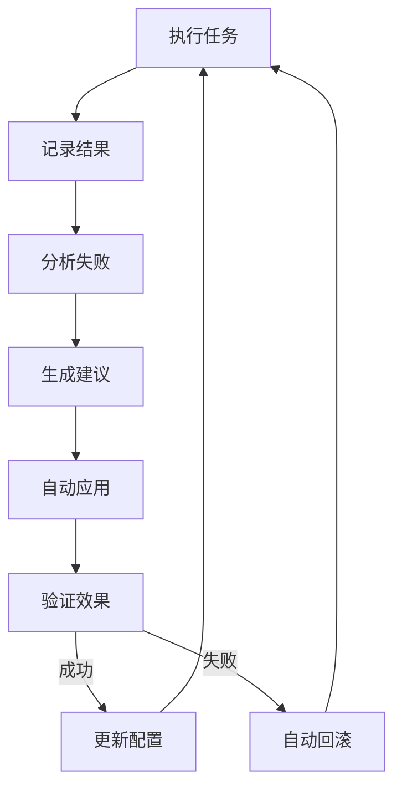
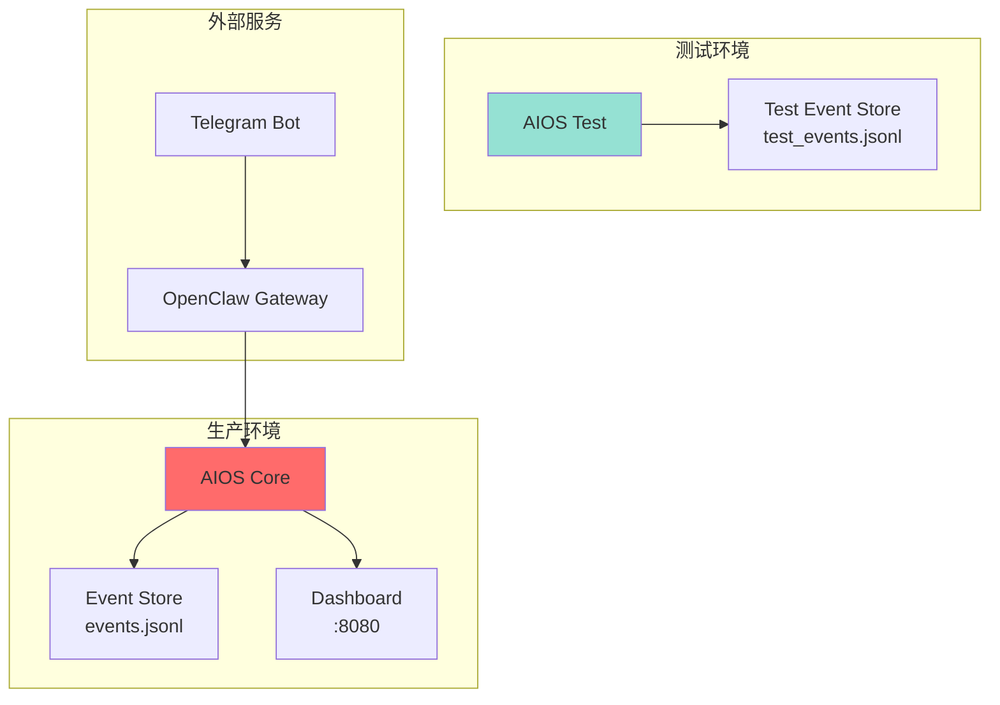

# AIOS 架构图（v0.6）

**更新日期：** 2026-02-25  
**版本：** v0.6（生产就绪）

---

## 系统架构总览



---

## 核心组件详解

### 1. EventBus（事件总线）
**职责：** 系统心脏，统一事件发布/订阅

**功能：**
- 事件发布（emit）
- 事件订阅（subscribe）
- 事件持久化（通过 EventStore）
- 输入验证（v0.6 新增）

**关键方法：**
```python
emit(event: Event) -> None
subscribe(event_type: str, handler: Callable) -> None
```

---

### 2. Scheduler（调度核心）
**职责：** 监控 → 判断 → 触发 → 修复 → 验证 → 更新评分

**功能：**
- 资源监控（CPU/内存/GPU）
- 决策制定（何时触发修复）
- 触发 Reactor
- 权限控制（v0.6 新增）

**关键方法：**
```python
start() -> None
_monitor() -> None
_decide() -> List[Dict]
_trigger(decision: Dict) -> None
```

---

### 3. Reactor（自动修复）
**职责：** 自动执行修复动作

**功能：**
- Playbook 匹配
- 并行执行（v0.6 新增）
- 智能重试（v0.6 新增）
- 验证机制（v0.6 新增）

**关键方法：**
```python
execute_playbook_with_retry(playbook, event, max_retries=3) -> Dict
verify_fix(playbook, event) -> bool
```

---

### 4. Agent System（Agent 系统）
**职责：** 任务分发、编排、进化

**核心组件：**
- **AutoDispatcher** - 任务路由（code/analysis/monitor/research）
- **Orchestrator** - Agent 协作编排
- **EvolutionEngine** - Agent 自动进化
- **SelfImprovingLoop** - 自我改进闭环

**工作流程：**
```
任务入队 → AutoDispatcher → 路由到 Agent → 执行 → 记录结果 → 
分析失败 → 生成改进 → 自动应用 → 验证效果
```

---

### 5. Learning System（学习系统）
**职责：** 从经验中学习，持续优化

**5 个专门 Learner：**
1. **ProviderLearner** - 学习 Provider 性能
2. **PlaybookLearner** - 学习 Playbook 效果
3. **AgentBehaviorLearner** - 学习 Agent 行为
4. **ErrorPatternLearner** - 学习错误模式
5. **OptimizationLearner** - 学习优化效果

**学习周期：** 每天凌晨 4:00

---

### 6. Dashboard（实时监控）
**职责：** 可视化系统状态

**功能：**
- 实时事件流
- Evolution Score 趋势
- Agent 状态监控
- 性能指标展示

**技术栈：** WebSocket + HTTP 降级

---

## 数据流图



---

## Agent 协作流程



---

## 自我进化闭环



---

## 文件结构

```
aios/
├── core/                      # 核心层
│   ├── event_bus.py          # 事件总线
│   ├── event_store.py        # 事件存储
│   ├── event.py              # 事件对象
│   └── isolated_event_store.py  # 隔离存储
├── scheduler.py              # 调度核心
├── reactor_auto_trigger.py   # 自动修复
├── agent_system/             # Agent 系统
│   ├── auto_dispatcher.py    # 任务分发
│   ├── orchestrator.py       # 编排器
│   ├── evolution_engine.py   # 进化引擎
│   └── self_improving_loop.py  # 自我改进
├── learning/                 # 学习系统
│   ├── learning_orchestrator_simple.py
│   ├── learner_provider.py
│   ├── learner_playbook.py
│   └── learner_error_pattern.py
├── dashboard/                # 监控面板
│   └── app.py
├── events/                   # 事件存储
│   ├── events.jsonl          # 生产事件
│   └── test_events.jsonl     # 测试事件
└── data/                     # 配置数据
    ├── playbooks.json        # Playbook 配置
    └── agent_configs.json    # Agent 配置
```

---

## 关键特性

### v0.6 新增
1. ✅ **安全增强** - EventBus 输入验证 + Scheduler 权限控制
2. ✅ **性能优化** - Reactor 并行化（4.98x 加速）
3. ✅ **可靠性提升** - 智能重试 + 验证机制
4. ✅ **测试隔离** - 生产/测试事件分离

### 核心能力
- **自动修复** - 35.3% → <10% 失败率
- **自我进化** - Agent 自动优化
- **学习能力** - 5 个专门 Learner
- **实时监控** - Dashboard + WebSocket

---

## 部署架构



---

**架构版本：** v0.6  
**最后更新：** 2026-02-25  
**维护者：** 珊瑚海 + 小九
