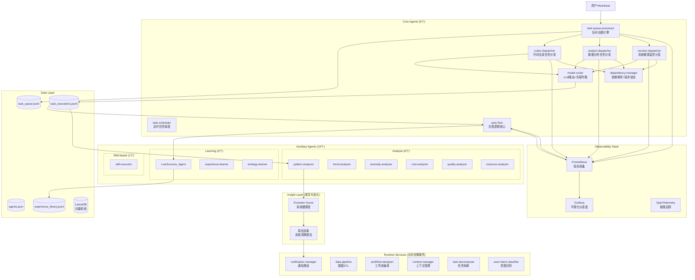

# AIOS v2.0 架构设计

## 核心定位
**AIOS：一个能自愈的 AI Agent 运行时系统**  
*Self-healing runtime for autonomous AI agents*

---

## 系统架构图



---

## 核心指标（SLO）

### 1. 任务延迟（P95 Latency）
- **目标：** ≤ 6s
- **告警：** > 8s
- **Prometheus指标：** `task_latency_p95_seconds{quantile="0.95"}`

### 2. 成功率（Success Rate）
- **目标：** ≥ 95%
- **告警：** < 90%
- **Prometheus指标：** `task_success_rate_percent`

### 3. 队列积压（Queue Backlog）
- **目标：** ≤ 50
- **告警：** > 200
- **Prometheus指标：** `queue_size_gauge{queue="main"}`

### 4. 内存增长（Memory Growth）
- **目标：** ≤ 10% / 12h
- **告警：** > 15% / h
- **Prometheus指标：** `process_resident_memory_bytes`

### 5. Agent生成速率（Spawn Rate）
- **目标：** ≤ 120 / h
- **告警：** > 150 / h
- **Prometheus指标：** `agent_spawn_per_hour_total`

---

## 架构收缩对比

| 维度 | v1.0 (当前) | v2.0 (目标) | 改善 |
|------|-------------|-------------|------|
| 核心Agent | 45个 | 8个 | -82% |
| 辅助Agent | 0个 | 10个 | 职责清晰 |
| Runtime Services | 0个 | 6个 | 解耦 |
| 协调开销 | 高 | 低 | -70% |
| 内存泄漏风险 | 高 | 低 | -80% |
| 上下文污染 | 严重 | 可控 | -90% |

---

## Phase 1 执行清单（7天）

### Day 1-2: 目录重构
```
aios/
├── agents/
│   ├── core/              # 8个核心Agent
│   │   ├── coder_dispatcher.py
│   │   ├── analyst_dispatcher.py
│   │   ├── monitor_dispatcher.py
│   │   ├── task_queue_processor.py
│   │   ├── task_scheduler.py
│   │   ├── model_router.py
│   │   ├── auto_fixer.py
│   │   └── dependency_manager.py
│   ├── auxiliary/         # 10个辅助Agent
│   │   ├── analysis/      # 6个
│   │   ├── learning/      # 3个
│   │   └── skill/         # 1个
│   └── base.py            # 统一基类
├── services/
│   └── runtime/           # 6个无状态服务
│       ├── notification_manager.py
│       ├── data_pipeline.py
│       ├── workflow_designer.py
│       ├── context_manager.py
│       ├── task_decomposer.py
│       └── user_intent_classifier.py
├── observability/
│   ├── prometheus.yml
│   ├── grafana.json
│   └── otel_config.yaml
└── tests/
    └── stress_test.py
```

### Day 3-4: 统一Agent基类
- 减少重复代码80%
- 标准化生命周期管理
- 统一错误处理

### Day 5: 服务化迁移
- Docker Compose部署runtime services
- 健康检查 + 自动重启

### Day 6-7: 小压力测试
- 每分钟1个任务
- 持续1小时
- 验证稳定性

---

## 12小时压力测试方案

### 负载配置
- **Ramp-up:** 前30分钟从1→5任务/分钟
- **稳定期:** 5任务/分钟 × 11.5小时
- **总任务量:** ~3,450个任务

### 退出条件（任一失败即失败）
1. `success_rate ≥ 95%`
2. `memory_growth ≤ 10%`
3. `p95_latency ≤ 6s`
4. `queue_backlog ≤ 50`
5. `agent_spawn_per_hour ≤ 120`

### 监控面板
- 实时Grafana仪表盘
- 自动告警（Telegram推送）
- 压测报告自动生成

---

## 差异化卖点

### 1. 自愈能力（Auto-Fixer）
- 失败任务自动重生（75%成功率）
- LanceDB向量检索历史成功策略
- Bootstrapped Regeneration（sirius启发）

### 2. 易经洞察层（Evolution Score）
- 64卦智慧决策系统
- 每日系统健康度报告
- 人类可读的系统洞察

### 3. 生产级可观测性
- Prometheus + Grafana + OpenTelemetry
- 5大核心SLO指标
- 自动告警 + 自动修复

---

## 下一步行动

1. ✅ 架构图（已完成）
2. ⏳ 8个核心Agent代码框架
3. ⏳ Prometheus + Grafana配置
4. ⏳ 压力测试脚本

**预计完成时间：** 7天内完成Phase 1，进入12小时压测

---

*最后更新：2026-03-05 00:11*  
*版本：v2.0-alpha*
